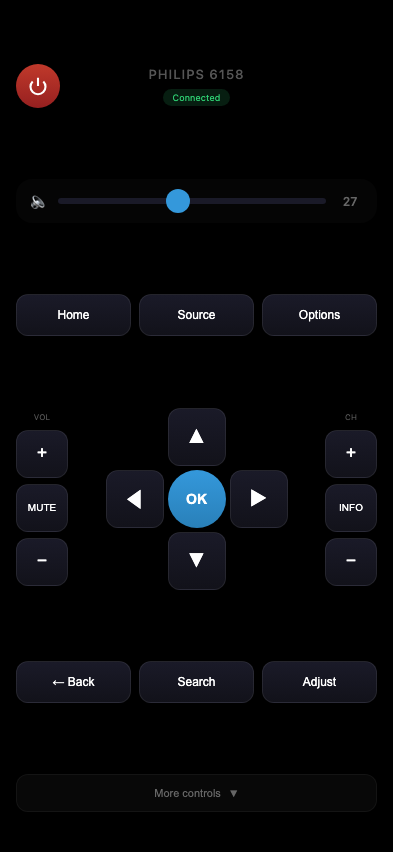
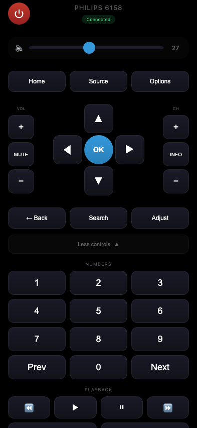

# Philips TV Remote

Web-based remote control for Philips Smart TV (JointSpace API v1). Available as web app and native iOS app.

**English** | [Українська](README.uk.md)

<p align="center">
  
  
</p>


## Supported TV

- **Model:** Philips 42PFL6158K/12 (and similar 6xxx series)
- **API:** JointSpace v1 (port 1925)

## Features

- Power on/off
- Navigation (arrows, OK, Back, Home)
- Volume control (+/-, mute, slider)
- Channel switching (+/-)
- Color buttons (red, green, yellow, blue)
- Playback controls (play, pause, stop, rewind, forward)
- Quick source switching (TV, HDMI, Blu-ray, etc.)
- Visual button feedback with haptic (iOS)
- Configurable server IP address in app
- PWA support (add to home screen on iOS/Android)
- Native iOS app (Capacitor)

## Installation

### Quick Start

```bash
git clone https://github.com/zloi2ff/philips-remote.git
cd philips-remote
python3 server.py
```

Open http://localhost:8888 in your browser.

### Configuration

Edit `server.py` to change TV IP address:

```python
TV_IP = "192.168.31.214"  # Your TV IP
TV_PORT = 1925
SERVER_PORT = 8888
```

### Auto-start (Linux systemd)

```bash
sudo cp philips-remote.service /etc/systemd/system/
sudo systemctl daemon-reload
sudo systemctl enable philips-remote
sudo systemctl start philips-remote
```

## Usage on iPhone/Android

### Web App (PWA)

1. Open `http://YOUR_SERVER_IP:8888` in Safari/Chrome
2. Tap Share button → "Add to Home Screen"
3. Use as a native app

### Native iOS App

Build and install with Xcode:

```bash
# Install dependencies
npm install

# Sync with iOS
npx cap sync ios

# Open in Xcode
npx cap open ios
```

In Xcode:
1. Select your iPhone device
2. Configure signing (Signing & Capabilities → Team)
3. Press Run (Cmd+R)

**Configure server IP in the app:**
- Tap the gear icon (top right)
- Enter your Mac's IP address and port (8888)
- Save

## API Reference

The TV uses JointSpace API v1:

| Endpoint | Method | Description |
|----------|--------|-------------|
| `/1/system` | GET | System info |
| `/1/audio/volume` | GET/POST | Volume control |
| `/1/sources` | GET | Available sources |
| `/1/sources/current` | POST | Switch source |
| `/1/input/key` | POST | Send remote key |

### Key codes

`Standby`, `VolumeUp`, `VolumeDown`, `Mute`, `ChannelStepUp`, `ChannelStepDown`, `CursorUp`, `CursorDown`, `CursorLeft`, `CursorRight`, `Confirm`, `Back`, `Home`, `Source`, `Info`, `Options`, `Find`, `Adjust`, `Digit0`-`Digit9`, `Play`, `Pause`, `Stop`, `Rewind`, `FastForward`, `Record`, `RedColour`, `GreenColour`, `YellowColour`, `BlueColour`

## License

MIT
