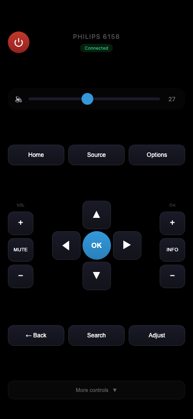
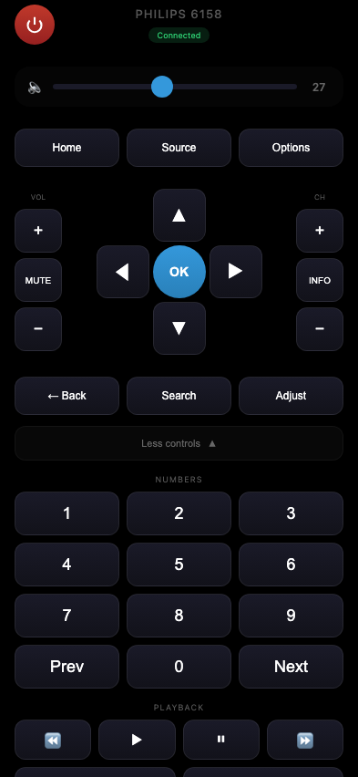

# Philips TV Remote

Веб-пульт для телевізора Philips Smart TV (JointSpace API v1/v5/v6). Доступний як веб-додаток та нативний iOS застосунок з віджетом на домашньому екрані.


[English](README.md) | **Українська**

<p align="center">
  
  
</p>

## Підтримувані телевізори

- **Модель:** Philips 42PFL6158K/12 (та схожі серії 6xxx)
- **API:** JointSpace v1 (порт 1925)

## Можливості

- Автопошук телевізорів Philips у локальній мережі
- Ручне введення IP-адреси телевізора
- Увімкнення/вимкнення
- Навігація (стрілки, OK, Назад, Додому)
- Керування гучністю (+/-, без звуку, слайдер)
- Перемикання каналів (+/-)
- Кольорові кнопки (червона, зелена, жовта, синя)
- Керування відтворенням (play, pause, stop, перемотка)
- Швидке перемикання джерел (TV, HDMI, Blu-ray тощо)
- Візуальний відгук з вібрацією (iOS)
- PWA підтримка (додавання на домашній екран iOS/Android)
- Нативний iOS застосунок (Capacitor)
- **Віджет на домашньому екрані** — Vol+/Vol-/Mute/Standby без відкриття додатку (iOS 17+, Liquid Glass на iOS 26+)

## Встановлення

### Швидкий старт

```bash
git clone https://github.com/zloi2ff/philips-remote.git
cd philips-remote
python3 server.py
```

Відкрий http://localhost:8888 у браузері. Додаток запропонує знайти телевізор у мережі або ввести IP вручну.

### Налаштування

Сервер налаштовується через змінні середовища:

```bash
# Встановити IP телевізора (опціонально — можна налаштувати через веб-інтерфейс)
TV_IP=192.168.1.100 python3 server.py

# Змінити порт сервера
SERVER_PORT=9000 python3 server.py

# Порт телевізора (за замовчуванням: 1925)
TV_PORT=1925 python3 server.py
```

## Використання на iPhone/Android

### Веб-додаток (PWA)

1. Відкрий `http://IP_СЕРВЕРА:8888` в Safari/Chrome
2. Натисни Поділитись → "На Початковий екран"
3. Використовуй як звичайний додаток

### Нативний iOS застосунок

Збірка та встановлення через Xcode:

```bash
# Встановити залежності
npm install

# Синхронізувати з iOS
npx cap sync ios

# Відкрити в Xcode
npx cap open ios
```

В Xcode:
1. Вибери свій iPhone
2. Налаштуй підпис (Signing & Capabilities → Team)
3. Натисни Run (Cmd+R)

## API

Телевізор використовує JointSpace API v1:

| Endpoint | Метод | Опис |
|----------|-------|------|
| `/1/system` | GET | Інформація про систему |
| `/1/audio/volume` | GET/POST | Керування гучністю |
| `/1/sources` | GET | Доступні джерела |
| `/1/sources/current` | POST | Перемикання джерела |
| `/1/input/key` | POST | Надсилання команди |

### Ендпоінти сервера

| Endpoint | Метод | Опис |
|----------|-------|------|
| `/discover` | GET | Пошук телевізорів Philips у мережі |
| `/config` | GET | Поточна конфігурація TV IP |
| `/config` | POST | Встановити IP TV (`{"ip": "...", "port": ...}`) |

### Коди клавіш

`Standby`, `VolumeUp`, `VolumeDown`, `Mute`, `ChannelStepUp`, `ChannelStepDown`, `CursorUp`, `CursorDown`, `CursorLeft`, `CursorRight`, `Confirm`, `Back`, `Home`, `Source`, `Info`, `Options`, `Find`, `Adjust`, `Digit0`-`Digit9`, `Play`, `Pause`, `Stop`, `Rewind`, `FastForward`, `Record`, `RedColour`, `GreenColour`, `YellowColour`, `BlueColour`

## Ліцензія

MIT
